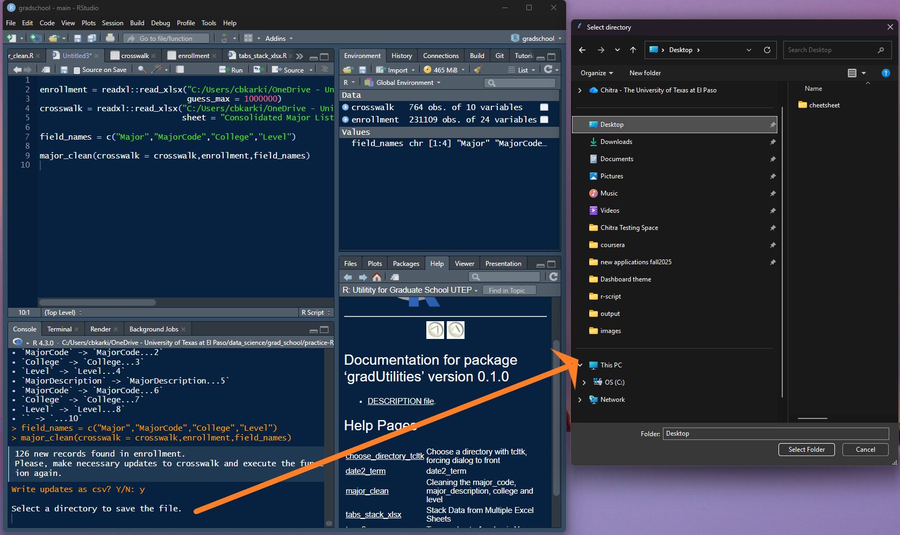
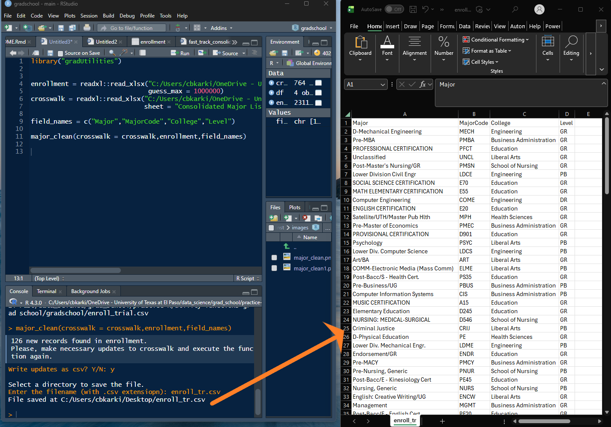

gradUtilities: Utilities functions for Grad School UTEP
================
Chitra Karki

## About

This package is packed with routine functions utilized most frequently
in data processing at Graduate School - UTEP.

## Installation

``` r
devtools::install_github("cbkarki/gradUtilities")
```

## Load the library to R-environment.

``` r
library(gradUtilities)
library(dplyr)
```

## major_clean

This functions cleans the major_code, major_descriptions college and
level with the help of crosswalk table which contains up to date records
of change in major and its respective alliances. If new records are
present in those fields, the program will provide the new records. once
the function is executed it will prompt, to write output as csv file in
used picked directory if new records are presents in the file2clean
other then in the crosswalk. run “?major_clean” for more details on
operating the program. We need to verify those new records and append to
the existing crosswalk and re-execute this program. the verification
requires some domain knowledge how majorcodes, majordescriptions,
college and level are encoded and their existence in the university
system. If no updates are present in the file2clean, then the program
will prompt users where to save the cleaned file.

``` r
crosswalk = readxl::read_xlsx("C:/Users/chitr/............................./Crosswalk Table.xlsx", sheet = "Consolidated Major List Update")

file2clean = readxl::read_xlsx("C:/Users/chitr/............................../Application and Admissions.xlsx", sheet = "Sheet1")

fieldnames = c("MajorCode", "MajorDescription", "CollegeDescription", "AdmissionTypeCode") 

major_clean(crosswalk,file2clean,fieldnames)
```

The prompts popups, are demonstrated in the images below.



## date2_term

This function converts given date to the respective term. At the
graduate school, an academic year constitutes of 3-terms. For instance,
academic year 2023-2024 has three terms in it, i.e., Fall 2023
(September, October, November, and December), Spring 2024 (January,
February, March, April,and May) and Summer 2024 (June, July, and
August).

``` r
 # example 1
 date1 = as.Date("2024-10-16")
 date2_term(date1,"code")
#> [1] "202510"
 date2_term(date1,"desc")
#>      202510 
#> "Fall 2024"

 # example 2
 df = data.frame(date = c("2024-10-16","2024-1-29","2024-7-16"))

 df %>%
 dplyr::mutate(term_code = date2_term(date,"code"),
 term_desc = date2_term(date,"desc"))
#>         date term_code   term_desc
#> 1 2024-10-16    202510   Fall 2024
#> 2  2024-1-29    202420 Spring 2024
#> 3  2024-7-16    202430 Summer 2024
```

## term_desc

The terms in the academic area 2023-2024 are coded as 202410, 202420,
and 202430 for the terms in the Fall 2023, Spring 2024, and Summer 2024
respectively. This function converts the given codes of terms to their
description.

``` r
 # example 1
 term = c(202410,202420, 202430)
 term_desc(term)
#> [1] "Fall 2023"   "Spring 2024" "Summer 2024"

 # example 2
 term = c("202410",202420, 202430)
 term_desc(term)
#>        202410        202420        202430 
#>   "Fall 2023" "Spring 2024" "Summer 2024"

 # example 3
 df = data.frame(term = c(202410,202420, 202430))
 df %>%
 dplyr::mutate(term_desc = term_desc(term))
#>     term   term_desc
#> 1 202410   Fall 2023
#> 2 202420 Spring 2024
#> 3 202430 Summer 2024
```

## term2_ay

This function converts given terms to respective AY. Refer above for the
academic year and its terms encoding. The function can take up either
character or integer term encoding.

``` r
 # example 1
  term = c("202410", "202420")
  term2_ay(term)
#> [1] "2023-2024" "2023-2024"
  
# example 2
 df = data.frame(term = c(202410,202420, 202430, 201020, 201530))
 df %>%
 dplyr::mutate(AY = term2_ay(term))
#>     term        AY
#> 1 202410 2023-2024
#> 2 202420 2023-2024
#> 3 202430 2023-2024
#> 4 201020 2009-2010
#> 5 201530 2014-2015
```

## term_diff

This function calculates the number of academic terms between a
`start_term` and an `end_term`. It assumes a standard academic year with
three terms (Fall, Spring, Summer), where terms are represented by a
four-digit year followed by a two-digit term code (e.g., ‘202310’ for
Spring 2023, ‘202320’ for Summer 2023, and ‘202330’ for Fall 2023). This
is particularly useful for calculating the elapsed time in terms between
a student’s enrollment and graduation. The calculation is inclusive of
both the start and end terms.

``` r
# Calculate the number of terms between Fall 2022 and Spring 2023
term_diff(start_term = 202230, end_term = 202310)
#> [1] 2

# Calculate the number of terms for a student who enrolled in Spring 2020
# and graduated in Fall 2023
term_diff(start_term = 202010, end_term = 202330)
#> [1] 12

 # function can also takes vectors of terms
 # it is ok use an single term as the argument in end_term, because multiple students can graduate
 # at the same term regardless of their starting term
 start_term = c(202010,202020)
 end_term = c(202510)
 term_diff(start_term,end_term)
#> [1] 16 15

 start_term = c(202010,201920, 201030, 202410)
 end_term = c(202510,202430,201130, 202410)
 term_diff(start_term,end_term)
#> [1] 16 17  4  1

 # if the end_term and start_term arguments different lengths with an exception of single end_term,
 # there will be an error
 start_term = c(202010,201920)
 end_term = c(202510,202430,202510)
 term_diff(start_term,end_term)
#> Error in term_diff(start_term, end_term): For end_term more then one entrires, it is required to have same amout of entries in start_term and end_term, otherwise the
#>              end_term will be recycled and results will be inconsistant.

 start_term = c(202010,201920,202510)
 end_term = c(202510,202430)
 term_diff(start_term,end_term)
#> Error in term_diff(start_term, end_term): For end_term more then one entrires, it is required to have same amout of entries in start_term and end_term, otherwise the
#>              end_term will be recycled and results will be inconsistant.
```

## summarize_dataframe

Summarize a Data Frame’s Structure and Content

Generates a comprehensive summary data frame detailing each column’s
name, type, missing values (count and percentage), number of unique
values, and basic descriptive statistics (mean, median, min, max) for
numeric columns.

``` r
 # Example using the built-in 'iris' dataset
  summarize_dataframe(iris)
#>   SN        Names Col_Type NA_Count NA_Per Unique_Values     Mean Median Min
#> 1  1 Sepal.Length  numeric        0      0            35 5.843333   5.80 4.3
#> 2  2  Sepal.Width  numeric        0      0            23 3.057333   3.00 2.0
#> 3  3 Petal.Length  numeric        0      0            43 3.758000   4.35 1.0
#> 4  4  Petal.Width  numeric        0      0            22 1.199333   1.30 0.1
#> 5  5      Species   factor        0      0             3       NA     NA  NA
#>   Max
#> 1 7.9
#> 2 4.4
#> 3 6.9
#> 4 2.5
#> 5  NA

 # Example with mixed data types
  test_data <- data.frame(
    id = 1:10,
    name = letters[1:10],
    value = c(1, 2, NA, 4, 5, 6, 7, NA, 9, 10)
  )
  summarize_dataframe(test_data)
#>   SN Names  Col_Type NA_Count NA_Per Unique_Values Mean Median Min Max
#> 1  1    id   integer        0      0            10  5.5    5.5   1  10
#> 2  2  name character        0      0            10   NA     NA  NA  NA
#> 3  3 value   numeric        2     20             9  5.5    5.5   1  10
```
