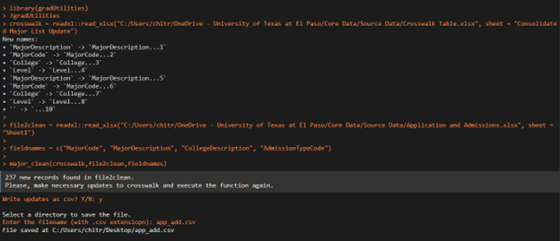

gradUtilities: Utilities functions for Grad School UTEP
================
Chitra Karki

## About

This package is packed with routine functions utilized most frequently
in data processing at Graduate School - UTEP.

## Installation

``` r
devtools::install_github("cbkarki/gradUtilities")
```

## Load the library to R-environment.

## date2_term

This function converts given date to the respective term. At the
graduate school, an academic year constitutes of 3-terms. For instance,
academic year 2023-2024 has three terms in it, i.e., Fall 2023
(September, October, November, and December), Spring 2024 (January,
February, March, April,and May) and Summer 2024 (June, July, and
August).

``` r
 # example 1
 date1 = as.Date("2024-10-16")
 date2_term(date1,"code")
#> [1] "202510"
 date2_term(date1,"desc")
#>      202510 
#> "Fall 2024"

 # example 2
 df = data.frame(date = c("2024-10-16","2024-1-29","2024-7-16"))

 df %>%
 dplyr::mutate(term_code = date2_term(date,"code"),
 term_desc = date2_term(date,"desc"))
#>         date term_code   term_desc
#> 1 2024-10-16    202510   Fall 2024
#> 2  2024-1-29    202420 Spring 2024
#> 3  2024-7-16    202430 Summer 2024
```

## term_desc

The terms in the academic area 2023-2024 are coded as 202410, 202420,
and 202430 for the terms in the Fall 2023, Spring 2024, and Summer 2024
respectively. This function converts the given codes of terms to their
description.

``` r
 # example 1
 term = c(202410,202420, 202430)
 term_desc(term)
#> [1] "Fall 2023"   "Spring 2024" "Summer 2024"

 # example 2
 term = c("202410",202420, 202430)
 term_desc(term)
#>        202410        202420        202430 
#>   "Fall 2023" "Spring 2024" "Summer 2024"

 # example 3
 df = data.frame(term = c(202410,202420, 202430))
 df %>%
 dplyr::mutate(term_desc = term_desc(term))
#>     term   term_desc
#> 1 202410   Fall 2023
#> 2 202420 Spring 2024
#> 3 202430 Summer 2024
```

## term2_ay

This function converts given terms to respective AY. Refer above for the
academic year and its terms encoding. The function can take up either
character or integer term encoding. once the function is executed it
will prompt, to write output as csv file in used picked directory if new
records are presents in the file2clean other then in the crosswalk.

``` r
 # example 1
  term = c("202410", "202420")
  term2_ay(term)
#> [1] "2023-2024" "2023-2024"
  
# example 2
 df = data.frame(term = c(202410,202420, 202430))
 df %>%
 dplyr::mutate(term_desc = term2_ay(term))
#>     term term_desc
#> 1 202410 2023-2024
#> 2 202420 2023-2024
#> 3 202430 2023-2024
```

## major_clean

This functions cleans the major_code, major_descriptions college and
level with the help of crosswalk table which contains up to date records
of change in major and its respective alliances. If new records are
present in those fields, the program will provide the new records. once
the function is executed it will prompt, to write output as csv file in
used picked directory if new records are presents in the file2clean
other then in the crosswalk. run “?major_clean” for more details on
runing the program. We need to verify those new records and append to
the existing crosswalk and re-execute this program. the verification
requires some domain knowledge how majorcodes, majordescriptions,
college and level are encoded and their existence in the university
system.

``` r
crosswalk = readxl::read_xlsx("C:/Users/chitr/OneDrive - University of Texas at El Paso/Core Data/Source Data/Crosswalk Table.xlsx", sheet = "Consolidated Major List Update")

file2clean = readxl::read_xlsx("C:/Users/chitr/OneDrive - University of Texas at El Paso/Core Data/Source Data/Application and Admissions.xlsx", sheet = "Sheet1")

fieldnames = c("MajorCode", "MajorDescription", "CollegeDescription", "AdmissionTypeCode") 

major_clean(crosswalk,file2clean,fieldnames)
```

The prompts popups are demonstrated in the image below.


